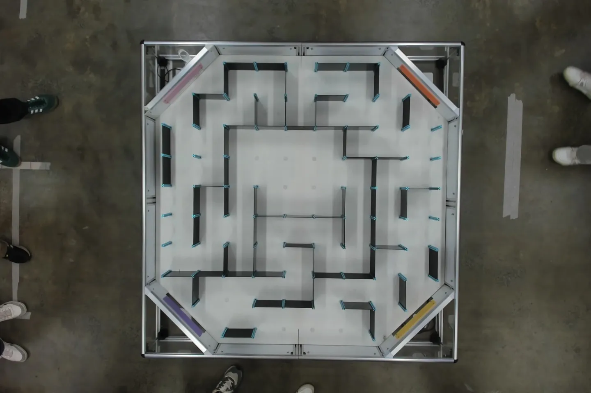
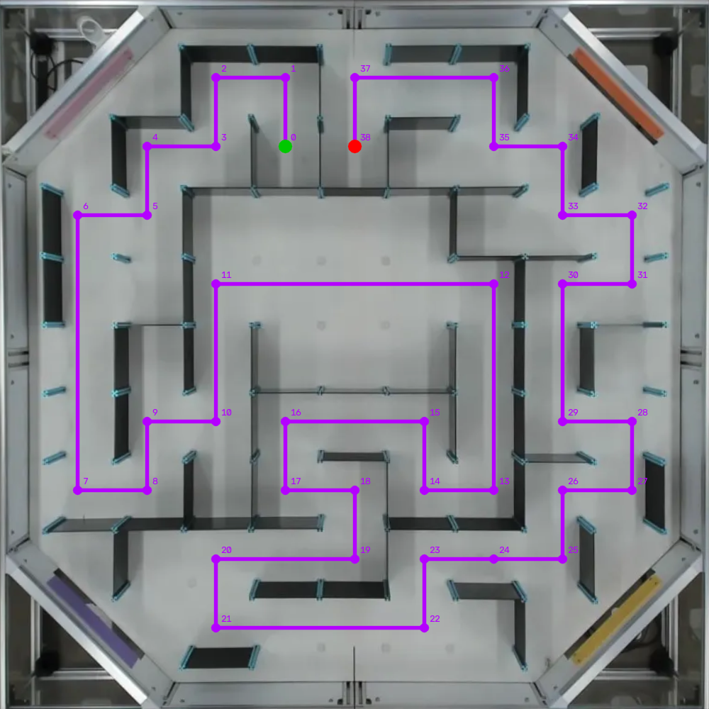
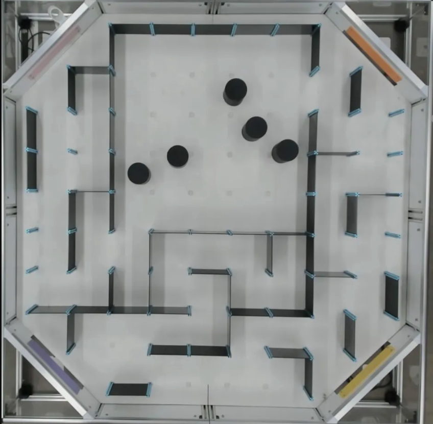
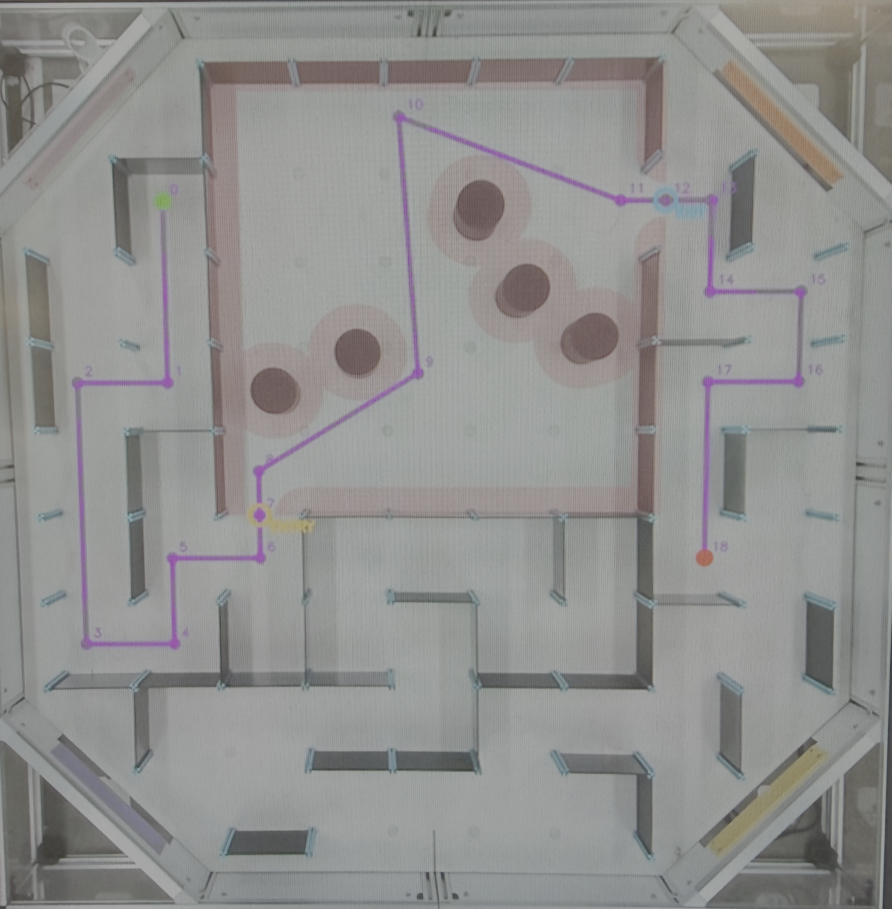

# MTRN3100 Micromouse (Team Mechatronics Mouse)

A custom micromouse robot developed for **MTRN3100 Robot Design** at UNSW. This project integrates embedded control, computer vision, and autonomous navigation to solve a **9 × 9 maze** consisting of 180mm square cells.

> **Note:** To respect course IP, this public repository provides a scaffolded codebase outlining the system architecture. Core assessable algorithms are omitted as an exercise for the reader.

## Hardware Platform

The robot is constrained to a 150mm diameter and operates entirely onboard an Arduino Nano (ATmega328). The hardware stack includes:

* **Power:** 9V Li-Ion battery with a custom distribution PCB.
* **Actuation:** Micro metal gearmotors with wheel encoders, driven by a DRV8835 dual motor driver.
* **Sensing:** An MPU-6050 IMU and three VL6180X time-of-flight (LiDAR) distance sensors (front, left, right).
* **UI:** An onboard SSD1306 128x64 OLED display.

Extensive calibration was required for encoder distance conversion, motor bias, minimum PWM, PID gains, and sensor filtering. The retained values serve as baseline starting points.

## Firmware Architecture

The firmware is structured to separate hardware interfaces from core logic:

* **Hardware Wrappers:** Thin interfaces around each hardware component, including `Motor`, `IMU`, `Lidar`, `OLED`, `DualEncoder`, `MovingAverageFilter`, and `PIDController`.
* **Shared Robot Components:** Common hardware and control objects used across the three task implementations.
* **Movement Primitives:** The motion operations everything else is built from, including PID-regulated rotation, LiDAR-assisted wall-centering, and IMU-based straight movement.
* **AutoMapping:** Autonomous maze exploration, onboard map construction, and shortest-path navigation using graph-based approaches.

### Task Selection

The target behavior is determined by a compile-time configuration, which chooses the entry point:

* **Task 4.1:** Executes a generated move sequence through the maze.
* **Task 4.2:** Drives a calculated continuous path trajectory through an obstacle field.
* **Task 4.3:** Autonomously maps the maze and then navigates a shortest path to the goal.

## Building & Flashing

The project provides both Arduino IDE and PlatformIO configurations. For the **PlatformIO** setup (in `platformio/`):

```bash
pio run                   # build the firmware
pio run --target upload   # flash to the Arduino Nano
pio device monitor        # open the serial monitor
```

Set the desired task flag in the configuration header prior to building to ensure the correct behavior executes.

## Task 4.1: Micromouse Race

The first task was a traditional race. Our computer-vision pipeline received an image of the maze alongside start/goal cells and starting orientation. It rectified the image, extracted traversable cells, built a graph representation, and generated a command sequence for autonomous execution.

The `pathplanning/` directory contains the Python pipeline scaffold. Key challenges included rectifying the maze image, extracting traversable cells, building a graph representation, and converting paths into motion commands.

<table align="center">
  <tr>
    <td align="center" width="50%"></td>
    <td align="center" width="50%"></td>
  </tr>
  <tr>
    <th align="center">Original Maze</th>
    <th align="center">Generated Path</th>
  </tr>
</table>

## Task 4.2: Continuous Path Planning

A 5 × 5 section of the maze was replaced with an obstacle course of 100mm diameter cylinders. The pipeline produced a collision-free continuous trajectory through the region, converted into turn/distance commands.

Implementing this requires evaluating sampling-based motion planners such as PRM, RRT, or RRT* to find an appropriate solution for a small, static obstacle field.

<table align="center">
  <tr>
    <td align="center" width="50%"></td>
    <td align="center" width="50%"></td>
  </tr>
  <tr>
    <th align="center">Original Maze</th>
    <th align="center">Generated Trajectory</th>
  </tr>
</table>

### Task 4.1 & 4.2 Runs

<table align="center">
  <tr>
    <th align="center">Task 4.1: Micromouse Race (5× speed)</th>
    <th align="center">Task 4.2: Continuous Path (5× speed)</th>
  </tr>
  <tr>
    <td align="center" width="50%">
      <video width="100%" src="https://github.com/user-attachments/assets/1d0ccbc4-f304-4cbb-b140-5ebec5d95236"></video>
    </td>
    <td align="center" width="50%">
      <video width="100%" src="https://github.com/user-attachments/assets/21435254-0caf-41f8-ac60-e91b5eb76b57"></video>
    </td>
  </tr>
</table>


## Task 4.3: Autonomous Mapping

With the precomputed map removed, the robot is provided solely with its start and goal coordinates. It must now perform both **exploration and mapping** entirely autonomously. As the robot searches the unknown maze, it constructs an internal representation and visualizes a real-time completion percentage on the OLED screen. Once enough of the maze is understood, it executes a shortest-path run to the goal.

This phase requires choosing suitable graph-based approaches for both exploration and shortest-path planning on a memory-constrained microcontroller. A useful hint is to watch the mapping video closely, observe how the robot behaves when it reaches unexplored paths or dead ends, and consider which graph algorithms could produce that behaviour.

<table align="center">
  <tr>
    <th align="center">Autonomous Mapping (20× speed)</th>
    <th align="center">Shortest-Path Run (5× speed)</th>
  </tr>
  <tr>
    <td align="center" width="50%">
      <video width="100%" src="https://github.com/user-attachments/assets/61f5bedb-a39c-4c1d-b6ab-32e6a2d5ec34"></video>
    </td>
    <td align="center" width="50%">
      <video width="100%" src="https://github.com/user-attachments/assets/c2fc1de2-6db7-4810-8aef-dc1d3a19b301"></video>
    </td>
  </tr>
</table>


## Repository Structure

```text
mtrn3100-micromouse/
├── arduino/                     # Arduino IDE firmware and hardware wrappers
├── platformio/                  # PlatformIO firmware
├── pathplanning/                # CV and path-planning scaffold
├── task_4_1_maze.webp           # Task 4.1 original maze image
├── task_4_1_planned.png         # Task 4.1 generated path image
├── task_4_2_maze.png            # Task 4.2 original maze image
├── task_4_2_planned.png         # Task 4.2 generated trajectory image
└── README.md
```

**Firmware (`arduino/` & `platformio/`):** Both Arduino IDE and PlatformIO implementations are provided. The code is organised around reusable interfaces for the motors, encoders, IMU, LiDAR sensors, OLED, PID control, and filtering, with separate task implementations for Tasks 4.1, 4.2, and 4.3. The public version preserves the architecture while omitting the central assessable algorithms.

**Path Planning (`pathplanning/`):** The Python-side pipeline handles image rectification, maze reconstruction, mapping, and waypoint generation for Tasks 4.1 and 4.2. Core solutions are intentionally excluded.

## Acknowledgements

Completed for **MTRN3100 Robot Design** at the **UNSW School of Mechanical and Manufacturing Engineering**. Course materials and hardware designs remain the IP of UNSW.

Thank you to the teaching team for a great opportunity to integrate embedded programming, control, sensing, computer vision, and motion planning on a physical robot.
